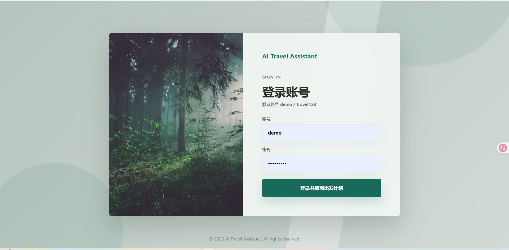
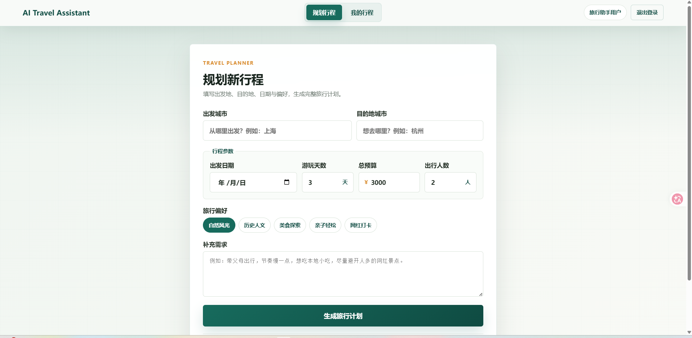
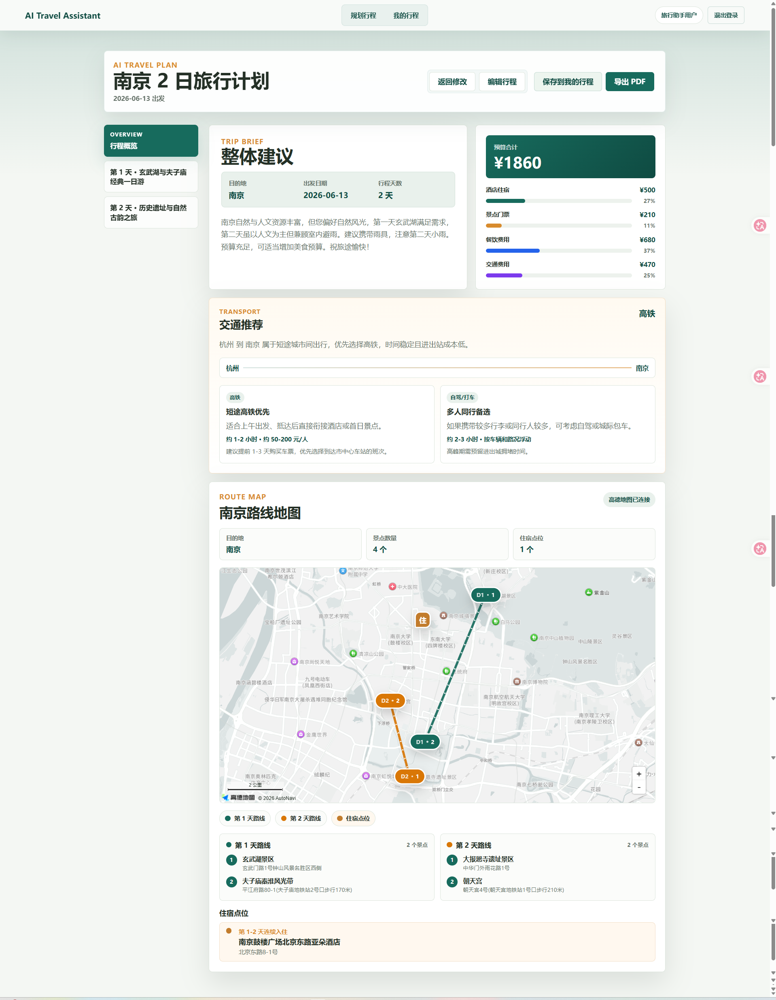
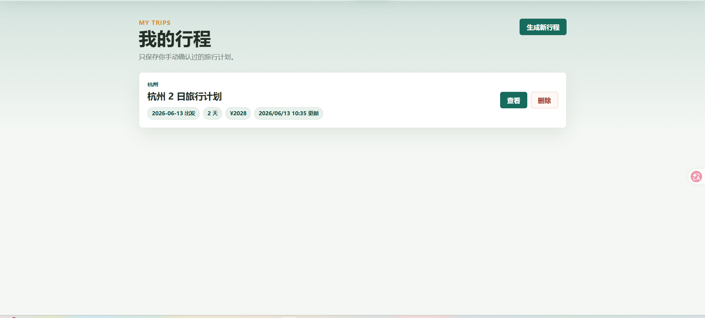
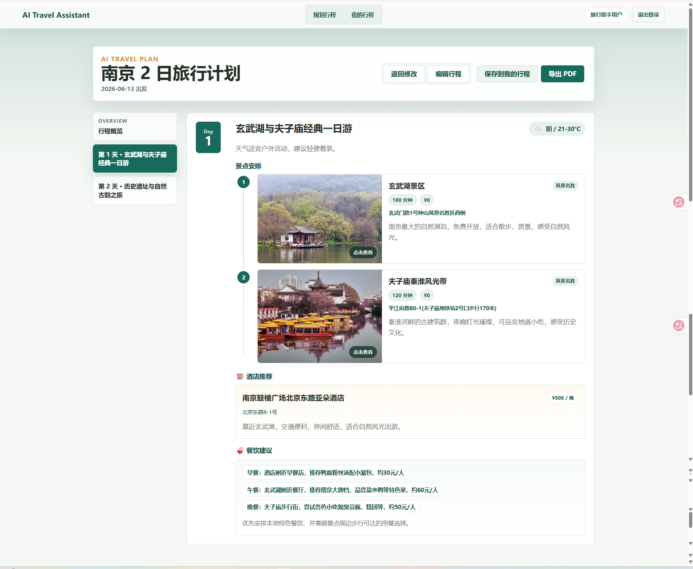
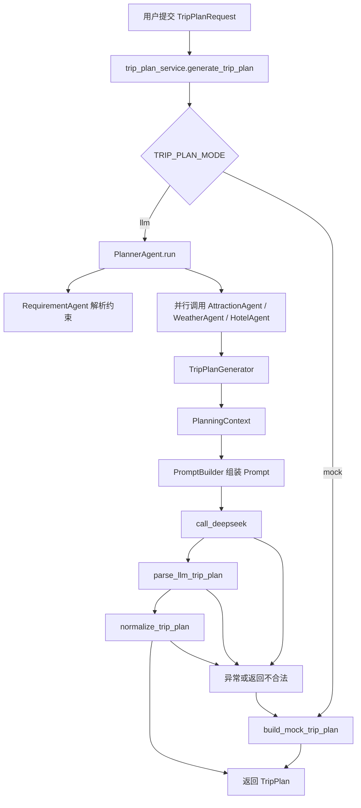
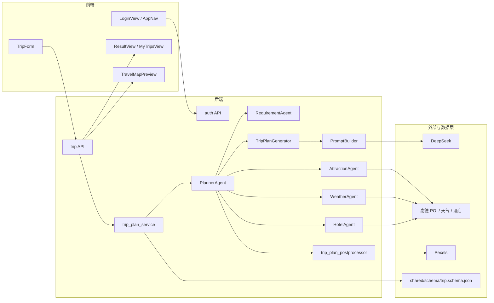

# 智能旅行助手（多智能体最终版）

一个基于 `Vue 3 + FastAPI + LLM` 的智能旅行规划项目。系统会根据用户输入的城市、出发日期、天数、预算、人数和旅行偏好，自动生成结构化旅行计划，并结合真实外部数据完成地图展示与结果导出。

## 项目亮点

- 基于 `DeepSeek` 生成多日旅行计划
- 接入高德真实 `POI`、天气、酒店数据
- 接入 `Pexels` 景点图片
- 支持动态城市解析，不依赖固定城市映射表
- 支持地图展示、酒店点位展示与按天路线区分
- 支持 PDF 导出
- 支持登录页、受保护规划路由、共享顶部导航和本地“我的行程”
- 已完成第一版多智能体协作架构
- 已加入日志、重试、并行和缓存优化
- 已完成 Agent 编排、生成和需求解析的结构化拆分
- 已加入后端 `pytest` 与前端 `Vitest` 回归测试
- 支持导出前后端共享 JSON Schema 数据契约

## 界面截图

### 登录页



### 规划页



### 行程概览页



### 历史记录页



### 详情页



## 当前架构

### 流程图



### 功能模块图



### 后端核心链路

```text
前端请求
-> POST /api/trip/plan
-> trip_plan_service.generate_trip_plan
-> PlannerAgent.run
   -> RequirementAgent
   -> AttractionAgent
   -> WeatherAgent
   -> HotelAgent
   -> TripPlanGenerator
      -> PlanningContext
      -> PromptBuilder 组装 Prompt
      -> DeepSeek 生成结构化 TripPlan
      -> parse_llm_trip_plan
      -> normalize_trip_plan
-> 返回前端
```

### 多智能体职责拆分

- `PlannerAgent`
  负责统一调度子 Agent、处理失败降级、调用计划生成模块。
- `AttractionAgent`
  负责景点候选搜索与景点上下文整理。
- `WeatherAgent`
  负责天气查询与天气上下文整理。
- `HotelAgent`
  负责酒店候选搜索与酒店上下文整理。
- `RequirementAgent`
  负责把用户偏好与补充需求解析为稳定的结构化旅行约束。
- `TripPlanGenerator`
  负责把上下文交给 LLM，并将输出标准化为最终 `TripPlan`。
- `PromptBuilder`
  负责把 `PlanningContext` 组装成最终 Prompt。

详细说明见 [docs/agent-architecture.md](docs/agent-architecture.md)。

## 功能概览

### 1. 登录与页面导航

- 入口 `/` 是登录页，默认账号为 `demo / travel123`
- 登录成功后进入 `/plan` 填写旅行需求
- `/plan`、`/result`、`/my-trips` 都需要登录后访问
- 登录后页面共享顶部导航，提供“规划行程”“我的行程”和退出登录入口

### 2. 行程生成

- 输入城市、日期、天数、预算、人数和偏好
- 自动生成多天结构化行程
- 每天包含：
  - 景点
  - 酒店
  - 餐饮建议
  - 天气信息

### 3. 真实数据增强

- 景点：高德 POI 搜索 + 清洗去重
- 天气：高德天气查询
- 酒店：高德酒店候选搜索 + 坐标
- 图片：Pexels 搜图

### 4. 地图展示

- 景点按天使用不同颜色显示
- 每天路线单独绘制
- 酒店使用独立图标显示
- 连续多天入住同一家酒店时自动合并点位

### 5. 结果管理与 PDF 导出

- 结果页支持编辑当前行程并重新计算预算
- 结果页支持保存到“我的行程”
- “我的行程”使用浏览器本地存储保存用户手动确认过的行程
- 结果页支持一键导出 PDF
- 基于 `html2canvas + jsPDF`

## 项目结构

```text
travel-assistant/
├─ backend/
│  ├─ app/
│  │  ├─ agents/
│  │  │  ├─ attraction_agent.py
│  │  │  ├─ weather_agent.py
│  │  │  ├─ hotel_agent.py
│  │  │  ├─ requirement_agent.py
│  │  │  ├─ requirement_schemas.py
│  │  │  ├─ planner_agent.py
│  │  │  ├─ prompt_builder.py
│  │  │  └─ schemas.py
│  │  ├─ api/
│  │  │  ├─ auth.py
│  │  │  ├─ trip.py
│  │  │  └─ trip_debug.py
│  │  ├─ models/
│  │  │  ├─ auth.py
│  │  │  └─ trip.py
│  │  └─ services/
│  │     ├─ amap_client.py
│  │     ├─ auth_service.py
│  │     ├─ poi_service.py
│  │     ├─ weather_service.py
│  │     ├─ hotel_service.py
│  │     ├─ image_service.py
│  │     ├─ amap_utils.py
│  │     ├─ trip_plan_postprocessor.py
│  │     ├─ llm_client.py
│  │     ├─ trip_plan_service.py
│  │     ├─ mock_trip_service.py
│  │     └─ cache_utils.py
│  ├─ scripts/
│  │  └─ export_trip_schema.py
│  ├─ tests/
│  └─ main.py
├─ frontend/
│  ├─ src/components/
│  ├─ src/services/
│  ├─ src/types/
│  ├─ src/router/
│  └─ src/views/
├─ docs/
│  └─ agent-architecture.md
├─ shared/
│  └─ schema/
│     └─ trip.schema.json
├─ README.md
└─ ROADMAP.md
```

## 技术栈

### 前端

- Vue 3
- TypeScript
- Vite
- Vue Router
- Axios
- `@amap/amap-jsapi-loader`
- `html2canvas`
- `jspdf`
- Vitest

### 后端

- FastAPI
- Pydantic
- httpx
- python-dotenv
- OpenAI SDK 兼容方式调用 DeepSeek
- pytest

### 外部服务

- DeepSeek API
- 高德 Web Service API
- 高德 JSAPI
- Pexels API

## 环境变量

### 后端 `backend/.env`

```env
TRIP_PLAN_MODE=llm
DEEPSEEK_API_KEY=your_deepseek_key
DEEPSEEK_MODEL=deepseek-v4-flash
AMAP_WEB_API_KEY=your_amap_webservice_key
PEXELS_API_KEY=your_pexels_api_key
TRAVEL_ASSISTANT_AUTH_USERNAME=demo
TRAVEL_ASSISTANT_AUTH_PASSWORD=travel123
TRAVEL_ASSISTANT_AUTH_DISPLAY_NAME=旅行助手用户
TRAVEL_ASSISTANT_AUTH_SECRET=replace_with_a_local_secret
TRAVEL_ASSISTANT_AUTH_TTL_DAYS=7
```

### 前端 `frontend/.env.local`

```env
VITE_API_BASE_URL=http://localhost:8003
VITE_AMAP_JSAPI_KEY=your_amap_jsapi_key
```

## 本地运行

### 1. 启动后端

```powershell
cd e:\Ai_Project\travel-assistant\backend
.\venv\Scripts\Activate.ps1
$env:TRIP_PLAN_MODE="llm"
uvicorn main:app --reload --port 8003
```

启动后访问：

- `http://localhost:8003/`
- `http://localhost:8003/docs`

### 2. 启动前端

```powershell
cd e:\Ai_Project\travel-assistant\frontend
npm.cmd install
npm.cmd run dev
```

默认开发地址：

- `http://localhost:5173`

### 3. 运行验证

#### 后端测试

```powershell
cd e:\Ai_Project\travel-assistant\backend
.\.venv\Scripts\python.exe -m pytest
```

#### 前端测试与构建

```powershell
cd e:\Ai_Project\travel-assistant\frontend
npm.cmd run test
npm.cmd run build
```

### 4. 重新生成前后端数据契约

当 `backend/app/models/trip.py` 中的 `TripPlanRequest` 或 `TripPlan` 结构发生变化时，运行：

```powershell
cd e:\Ai_Project\travel-assistant\backend
.\.venv\Scripts\python.exe scripts\export_trip_schema.py
```

生成结果位于：

- `shared/schema/trip.schema.json`

## API 说明

### 正式接口

- `POST /api/auth/login`
  登录并返回 bearer token
- `GET /api/auth/me`
  校验当前 bearer token 并返回当前用户
- `POST /api/trip/plan`
  生成正式旅行计划

### 调试接口

- `GET /api/trip/debug/poi`
  调试景点搜索
- `GET /api/trip/debug/weather`
  调试天气查询
- `GET /api/trip/debug/hotel`
  调试酒店搜索
- `GET /api/trip/debug/image`
  调试景点图片搜索

## 稳定性与性能优化

当前版本已加入以下工程化能力：

- 重试
  - 高德底层请求支持超时/网络错误轻量重试
- 并行
  - `PlannerAgent` 会并行调用景点、天气、酒店三个子 Agent
- 缓存
  - 景点、天气、酒店支持带容量上限的短时 TTL 缓存
  - 城市地理编码支持 `lru_cache`
- 外部数据错误语义
  - 高德配置错误、请求失败、响应异常使用独立异常类型区分
- 数据契约
  - 后端 Pydantic 模型可导出为 `shared/schema/trip.schema.json`
- 日志
  - 各 Agent 具备开始、成功、失败、耗时日志
- 兜底
  - 子 Agent 失败时支持降级
  - LLM 返回异常时支持结构修补和 fallback

## 结果页说明

结果页当前包含：

- 顶部结果信息与操作工具栏
- 行程概览
- 预算摘要
- 地图展示
- 每日景点安排
- 天气信息
- 酒店推荐
- 餐饮建议
- 景点图片
- 编辑行程
- 保存到我的行程
- PDF 导出

## 多智能体工作方式

可以把当前系统理解成“一个编排器 + 三个专业助手 + 一个计划生成器”：

- `AttractionAgent`
  提供景点候选
- `WeatherAgent`
  提供天气摘要
- `HotelAgent`
  提供酒店候选
- `TripPlanGenerator`
  组装上下文、调用大模型并标准化最终结果
- `PlannerAgent`
  汇总三者并处理失败降级

这属于第一版协作式多智能体架构，特点是：

- 职责明确
- 调度清晰
- 容易扩展
- 比单智能体版本更利于维护和优化

## 自动化测试覆盖

当前版本包含以下自动化测试：

- 后端 `pytest`
  - 登录账号校验、bearer token 签发与 `/api/auth/me` 校验
  - `TripPlan` 解析、标准化、兜底补齐
  - 高德 Adapter 错误语义
  - POI / 酒店 / 天气数据整理
  - PlannerAgent 编排和 fallback
  - PromptBuilder 与 RequirementAgent 结构化约束解析
  - TTL 缓存过期与容量控制
- 前端 `Vitest`
  - 登录状态持久化、当前用户刷新和退出登录清理
  - 我的行程本地保存、更新、查询和删除
  - 地图路线数据投影
  - 连续住宿点位合并
  - 无坐标住宿点跳过
- 前端 `Vitest` 运行正常

验证内容包括：

- `/api/trip/plan` 正常返回
- 景点、天气、酒店结果完整
- 酒店带真实坐标
- 地图可消费返回坐标

## 已知说明

- PDF 导出当前基于页面截图，长内容会自动分页
- 第三方地图瓦片在部分场景下可能影响 PDF 中的地图截图表现
- 外部接口网络波动时仍可能出现 warning，但系统保留了 fallback 和兜底逻辑

## 后续方向

- 完善单元测试与集成测试
- 进一步清理后端剩余历史乱码与注释
- 继续增强 PDF 导出体验
- 增强地图与卡片联动
- 继续升级更高级的多智能体协作模式
