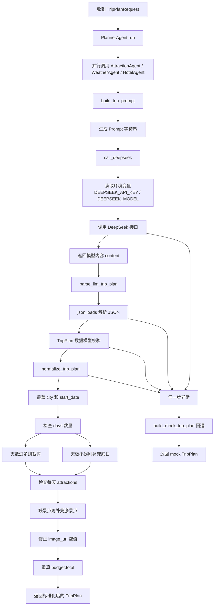
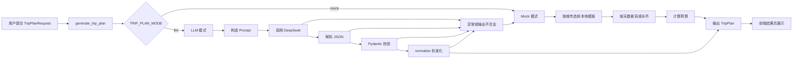

# 智能旅行助手开发路线图

## 项目目标

本项目的目标是构建一个基于多智能体协作的智能旅行助手。系统可以根据用户输入的目的地、日期、预算、人数和偏好，自动生成包含景点、天气、酒店、预算和地图展示的旅行计划。

项目采用渐进式开发路线：

```text
假数据 MVP -> 接入 LLM -> 接入真实外部 API -> 多智能体协作 -> 功能增强与体验优化
```

这样设计的核心原因是：先把产品闭环和数据结构跑通，再逐步替换数据来源和智能能力，避免一开始同时处理前端、后端、模型、地图 API 和多智能体调度带来的复杂度。

## 总体架构方向

系统最终采用前后端分离架构：

```text
用户
-> Vue3 前端
-> FastAPI 后端
-> 服务编排层
-> Agent 层
-> 外部服务层
```

各层职责如下：

- `前端层`：负责行程规划表单、结果展示、地图可视化、加载状态和导出入口。
- `后端 API 层`：负责请求接收、参数校验、响应封装和跨域配置。
- `服务编排层`：负责调度假数据、LLM、外部 API 或多个 Agent，并统一返回结果。
- `智能体层`：负责景点搜索、天气查询、酒店推荐、行程规划等专门任务。
- `外部服务层`：负责对接高德地图、天气服务、LLM API 等能力。

## 当前实现状态

当前代码已经落地了第一版多智能体协作，不再是单一 Planner 直接拼接整份计划。现有链路是：

```text
TripPlanRequest
-> PlannerAgent
   -> RequirementAgent
   -> AttractionAgent
   -> WeatherAgent
   -> HotelAgent
   -> TripPlanGenerator
   -> TripPlan
```

其中：

- `PlannerAgent` 负责编排、并行调度和 fallback。
- `TripPlanGenerator` 负责 prompt 组装、LLM 调用和结果标准化。
- `RequirementAgent` 负责把补充需求解析成更稳定的结构化约束。

前端也已经从单页填写表单演进为登录后工作台：

- `/` 是登录页。
- `/plan` 是旅行规划表单页。
- `/result` 是旅行计划结果页，支持编辑、保存到我的行程和 PDF 导出。
- `/my-trips` 是浏览器本地保存的行程列表。
- 登录后页面共享顶部导航，未登录访问受保护页面会回到登录页。

这些实现细节的说明见仓库根目录的 [README.md](README.md) 和 [docs/agent-architecture.md](docs/agent-architecture.md)。

## 阶段一：假数据 MVP

### 阶段目标

先完成一个不依赖 LLM、不依赖真实外部 API 的最小可运行版本。这个阶段的重点不是智能程度，而是验证完整业务流程是否成立。

### 要完成的功能

- 创建行程规划表单，支持输入目的地、出发日期、天数、预算、人数和偏好。
- 后端提供一个行程生成接口，接收前端表单数据。
- 后端返回固定结构的假数据，例如北京三日游、上海两日游等。
- 前端展示完整行程结果，包括每日安排、景点、酒店、天气、预算。
- 前端能够根据经纬度展示地图标点。
- 增加基础加载状态和错误提示。

### 推荐数据结构

第一阶段就要固定核心数据结构，后续所有阶段都围绕这套结构演进：

```text
TripPlanRequest
TripPlan
DayPlan
Attraction
Hotel
WeatherInfo
Budget
```

### 验收标准

- 用户可以在前端填写表单并提交。
- 后端可以收到请求并返回固定格式数据。
- 前端可以完整渲染行程结果。
- 即使没有 LLM 和外部 API，项目也能演示完整产品闭环。

### 阶段产出

- 一个可运行的前后端 Demo。
- 一套稳定的前后端数据格式。
- 一个基础结果展示页面。

## 阶段二：接入单个 LLM

### 阶段目标

用 LLM 替换固定假数据，让系统能够根据用户输入动态生成旅行计划。这个阶段先使用单一 Planner，不急着拆成多个 Agent。

### 要完成的功能

- 后端根据用户输入构造 Prompt。
- 调用 LLM API 生成旅行计划。
- 要求 LLM 返回固定 JSON 结构。
- 后端对 LLM 返回结果进行解析、校验和标准化处理。
- 前端继续复用阶段一的结果页展示结构。
- 当 LLM 返回失败或格式错误时，后端自动回退到 mock 数据。

### Prompt 设计重点

- 明确用户的目的地、日期、预算、人数和偏好。
- 明确每天需要多少景点和哪些展示字段。
- 明确输出必须是 JSON。
- 明确字段名称必须和 `TripPlan` 数据结构一致。
- 明确不要返回多余解释文本。

### 数据生成流程解析

当前项目中，数据生成可以概括为：

```text
用户输入 -> 前端发送请求 -> FastAPI 接收 -> 服务层决定生成模式 -> 生成 TripPlan -> 前端展示结果
```

其中核心设计原则是：

```text
前端始终只消费 TripPlan，后端可以替换 TripPlan 的生成方式。
```

这意味着前端不需要关心数据到底来自本地模板、LLM 还是未来的真实 API 与多智能体协作，只需要保证后端最终返回的是统一的 `TripPlan` 结构。

### LLM 模式内部流程图



### LLM 流程说明

- `build_trip_prompt`：把用户输入拼成结构化 Prompt。
- `call_deepseek`：调用 DeepSeek 模型，要求返回 JSON。
- `parse_llm_trip_plan`：把模型返回的字符串解析成 Python 字典，并映射为 `TripPlan`。
- `normalize_trip_plan`：修正天数、空字段和预算总和，保证前端拿到的数据稳定可渲染。
- `fallback`：只要模型调用失败、返回空内容、JSON 不合法或结构校验失败，就自动回退到 mock 数据。

### Mock 模式与 LLM 模式对比图



### Mock 与 LLM 模式对比

| 对比项 | Mock 模式 | LLM 模式 |
| --- | --- | --- |
| 数据来源 | 本地模板 | DeepSeek 动态生成 |
| 稳定性 | 高 | 中 |
| 智能性 | 低 | 高 |
| 是否依赖外部服务 | 否 | 是 |
| 是否需要解析校验 | 基本不需要 | 必须需要 |
| 是否适合前端联调 | 非常适合 | 适合后期联调 |
| 失败后的处理 | 本身稳定 | 回退到 Mock |

### 验收标准

- 输入不同城市和偏好时，可以得到不同的行程内容。
- LLM 返回的数据可以被前端稳定展示。
- 后端能够处理 LLM 输出异常，不会导致页面崩溃。

### 阶段产出

- 一个基于 LLM 的动态行程生成能力。
- 一份可复用的 Planner Prompt。
- 初步的模型输出容错机制。

## 阶段三：接入真实外部 API

### 阶段目标

让系统不再完全依赖 LLM 编造内容，而是使用真实地图和天气数据辅助规划。

### 要完成的功能

- 接入高德地图 POI 搜索，获取真实景点信息。
- 接入高德天气查询，获取目的地天气信息。
- 接入地理编码或逆地理编码，统一处理经纬度。
- 将真实景点、天气、酒店候选数据整理后交给 LLM。
- LLM 基于真实数据生成最终行程。
- 前端地图使用真实经纬度展示景点和酒店位置。

### 推荐接入顺序

1. 先接 POI 搜索，获取真实景点。
2. 再接天气查询，生成天气提醒。
3. 再接地理编码，补齐坐标。
4. 最后考虑路线规划。

### 验收标准

- 景点名称和坐标来自真实地图数据。
- 天气信息来自真实天气接口。
- LLM 生成的计划基于后端提供的真实候选数据。
- 地图标点可以和行程内容对应起来。

### 阶段产出

- 真实 POI 数据能力。
- 真实天气查询能力。
- 基于真实数据增强的行程生成流程。

## 阶段四：拆分为多智能体协作

### 阶段目标

将单一 Planner 拆成多个职责清晰的 Agent，形成最终的多智能体协作架构。本阶段对应的核心实现已经在代码中落地，当前重点转向继续增强稳定性和可扩展性。

### 智能体设计

- `RequirementAgent`：解析用户偏好、补充需求和出行约束。
- `AttractionAgent`：根据城市和偏好搜索景点，返回景点候选列表。
- `WeatherAgent`：查询天气，返回每日天气和出行建议。
- `HotelAgent`：根据预算、位置和出行人数推荐酒店。
- `TripPlanGenerator`：组装 prompt、调用 LLM 并标准化最终结果。
- `PlannerAgent`：整合景点、天气、酒店和用户偏好，生成最终行程。

### 推荐调用流程

```text
用户请求
-> FastAPI 接收参数
-> RequirementAgent 解析约束
-> AttractionAgent 查询景点
-> WeatherAgent 查询天气
-> HotelAgent 推荐酒店
-> TripPlanGenerator 生成行程
-> PlannerAgent 整合和降级
-> 返回 TripPlan 给前端
```

### 设计原则

- 每个 Agent 只负责一个清晰任务。
- 每个 Agent 都返回结构化结果。
- 后端服务层负责统一调度，不让多个 Agent 随意互相调用。
- PlannerAgent 只做编排和降级，不重复查询景点、天气和酒店。
- TripPlanGenerator 只做生成，不负责调度其他 Agent。
- 多智能体阶段继续沿用已经稳定的 `TripPlan` 数据结构。

### 验收标准

- 每个 Agent 可以独立测试。
- 任一非核心 Agent 失败时，系统可以降级处理。
- PlannerAgent 可以基于其他 Agent 的结果生成完整行程。
- TripPlanGenerator 可以独立测试 prompt 组装与结果标准化。
- 多智能体流程最终返回的数据格式与前端展示格式保持一致。

### 阶段产出

- 一个清晰的多智能体协作流程。
- 四个可独立维护的 Agent 模块。
- 一套可扩展的 Agent 调度方式。

## 阶段五：功能增强与用户体验优化

### 阶段目标

在核心智能规划能力稳定后，补充更完整的产品体验。

### 可选增强功能

- 行程编辑：支持增加、删除、调整景点顺序。
- 预算统计：展示门票、酒店、餐饮、交通的费用估算。
- 路线规划：展示景点之间的路线或出行方式。
- PDF 或图片导出：支持保存旅行计划。
- 历史记录：保存用户生成过的行程。
- 加载进度：展示“正在搜索景点、查询天气、推荐酒店、生成计划”等状态。
- 错误提示：区分网络错误、模型错误、地图 API 错误和无数据错误。

### 验收标准

- 用户可以对生成后的行程进行基础调整。
- 预算、地图、天气和每日计划展示清晰。
- 生成过程有明确反馈，不会让用户长时间等待无提示。
- 导出内容可读、稳定。

### 阶段产出

- 更完整的旅行助手体验。
- 更适合展示、答辩或作品集演示的最终版本。

## 推荐开发顺序

实际开发时建议按以下顺序推进：

1. 固定 `TripPlan` 等核心数据结构。
2. 用假数据跑通前后端完整流程。
3. 完成结果展示页和地图标点。
4. 接入单个 LLM，替换假数据生成逻辑。
5. 增加 LLM 输出校验和失败回退。
6. 接入高德 POI 和天气 API。
7. 将真实数据交给 LLM 进行整合。
8. 拆分为多个 Agent。
9. 增加行程编辑、预算统计、路线规划和导出。
10. 优化页面体验、错误处理和项目文档。

## 每阶段重点

| 阶段 | 重点 | 不建议过早做的事 |
| --- | --- | --- |
| 阶段一 | 数据结构、前后端闭环 | LLM、多 Agent、复杂地图路线 |
| 阶段二 | LLM 结构化输出 | 多 Agent 自由协作 |
| 阶段三 | 真实数据增强 | 复杂路线最优解 |
| 阶段四 | Agent 职责拆分 | 让 Agent 之间随意互调 |
| 阶段五 | 用户体验完善 | 大范围重构核心数据结构 |

## 最重要的原则

整个项目要始终保持一个稳定核心：

```text
前端只关心 TripPlan，后端可以逐步替换 TripPlan 的生成方式。
```

也就是说，数据来源可以从假数据变成 LLM，再变成真实 API + LLM，最后变成多智能体协作。但只要最终返回给前端的数据结构稳定，项目就能一步一步平滑升级。
